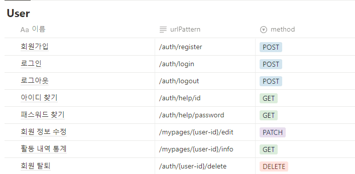
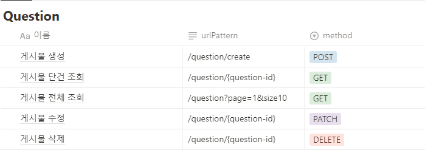
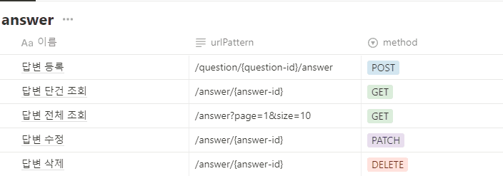

스택오버플로우 클론 코딩 (기간: 2.5주)

## 멤버

[김인환(FE, BE 통합 팀장)](https://github.com/Preasim) <br>
[류성현 (FE 팀장)](https://github.com/Pandaryu91) <br>
[박형진(BE)](https://github.com/phj19981008) <br>
[김현석(FE)](https://github.com/DAKSHOOD) <br>
[윤종협(FE)](https://github.com/hyobbeee)

<br>

## 개요

**User, Posts, Answer로 나눠서 역할분담을 했고 Posts, Answer 부분을 담당했다.**

요구사항의 1, 2 순위를 우선적으로 개발하고 추후에 3순위를 개발하기로 하고 ERD를 작성하였다.

<br>

## 사용자 요구사항

### 회원

| 기능 명 | 상세 설명 | 우선 순위 | 필수 구현사항 |
| --- | --- | --- | --- |
| 회원가입 |  | 1  | userId ,email, password, nickname |
| 회원수정 | 회원 정보 수정 | 1 | userId 제외 수정 |
| OAuth2 회원가입 | Google, github 아이디 연동 | 3 |  |
| ID / Password 찾기 |  | 1 | 아이디 비번 찾기 |
| 회원 정보 페이지 | 회원 정보 조회 페이지 | 2 | userId, email, nickname, 자기소개, 통계 기능 |
| 로그인 | 로그인 기능 | 1 | DB에 회원가입을 통해 로그인하면 JWT 토큰 발행 |
| 로그아웃 | 로그이웃 시 홈으로 리다이렉트 | 1 | 로그아웃 |
| Stats 조회 | 게시글 수, 답변 수, 추천 받은 수, 답변 및 질문 목록 | 3 | 게시글 수, 답변 수, 추천 받은 수, 답변 및 질문 목록 |
| 추천 기능 | 게시글, 답변 추천 받은 수 | 3 | 게시글, 답변 추천 받은 수 |

### 게시글

| 기능 명 | 상세 설명 | 우선 순위 | 필수 구현사항 |
| --- | --- | --- | --- |
| 게시글 등록, 조회 | 회원만 게시글 등록 | 1 | 게시글에 코드를 작성 (하이라이트), 좋아요 및 태그, 게시글 삭제는 작성자 및 운영진만 가능 |
| 게시글 수정 |  | 1 | 작성자 및 운영진만 가능 |
| 게시글 삭제 |  | 1 | 작성자 및 운영진만 가능 |
| 작성 게시글 임시저장 |  | 3 |  |
| 게시글 태그 | (태그별 검색 기능 사용) | 2 | 찾는 태그가 없다면 유저가 새로 생성  |
| 게시글 정렬 기능 | 추천순, 최신순 등 | 2 |  |
| 좋아요 기능 |  | 3 |  |
| 댓글 등록 |  | 1 |  |
| 제목 검색 |  | 1 |  |
| 조건 검색 | 태그, 기타 조건별 검색 | 3 |  |

### 답변

| 기능 명 | 상세 설명 | 우선 순위 | 필수 구현사항 |
| --- | --- | --- | --- |
| 답변 조회 |  | 1 | casacade |
| 답변 작성 | 게시물(질문)에 답변 기능 (비회원은 x) | 1 | casacade, 답변에 코드 작성 가능 (하이라이트), 답변에 좋아요 기능 |
| 답변 수정 |  | 1 | 작성자 및 운영진만 가능 |
| 답변 삭제 |  | 1 | 작성자 및 운영진만 가능 |
| 답변 추천 | 게시물 답변 추천하기, 가장 많은 추천 순대로 답변을 보여줌 | 3 | 회원만 좋아요 누를 수 있게, 두번 누르면 취소 |
| 댓글 등록 및 수정 | 답변의 덧글 | 2 | 작성자 및 운영진만 가능 |
| 정렬 기능 | 추천순, 최신순 등 | 3 |  |

<br>

## ERD

<p align="center"></p>

## API 명세

<p align="center"></p>

<p align="center"></p>

<p align="center"></p>

<p align="center"></p>

<br>

## Github 브랜치 전략

<p align="center"></p>

<br>

# 구현

Entity -> DTO -> Mapper -> Repository -> Service -> Controller 순으로 작성하였다.

### Auditable

```java
@Getter
@MappedSuperclass // 공통 속성을 가진 엔티티 클래스를 정의할 때 사용됨
@EntityListeners(AuditingEntityListener.class) // 엔티티에 이벤트 리스너를 등록
public abstract class Auditable {
    @CreatedDate // 엔티티가 생성될 때 자동으로 현재 시간을 할당해줌
    @Column(name = "created_at", updatable = false)
    private LocalDateTime createdAt;

    @LastModifiedDate // 엔티티가 수정될 때 자동으로 현재 시간을 갱신해줌
    @Column(name = "LAST_MODIFIED_AT")
    private LocalDateTime modifiedAt;
}
```

<br>

## Question

### Entity

```java
public class Question extends Auditable {
    @Id
    @GeneratedValue(strategy = GenerationType.IDENTITY)
    private Long questionId;

    @ManyToOne
    @JoinColumn(name = "user_id")
    private User userId;

    @Column(length = 20, nullable = false)
    private String title;

    @Lob
    @Column(nullable = false)
    private String content;

    @Min(0)
    private int views;

    private LocalDateTime createdAt;

    private LocalDateTime modifiedAt;
}
```

## Dto

```java
@Getter
public class QuestionCreateDto {
    @NotNull
    @Positive
    private Long userId;

    @NotBlank
    @Size(max = 20)
    private String title;

    @NotBlank
    private String content;

    @Min(0)
    private int views;
}
```