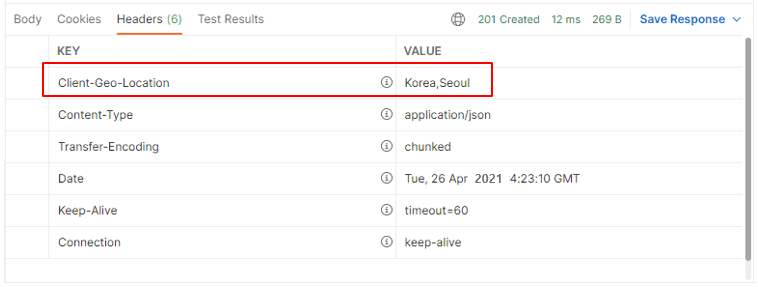

HTTP Header

<div class="cl1"></div>

## HTTP Header란?

HTTP 요청 및 응답 메시지의 메타 정보를 포함하는 부분이다.

웹 브라우저와 웹 서버 간의 통신을 제어하고 다양한 정보를 전달하는 데 사용된다.

<div class="cl3"></div>

HTTP헤더는 크게 두 가지로 나눌 수 있다.

<div class="cl3"></div>

**요청 헤더 (Request Header)**

클라이언트가 웹 서버에게 요청을 보낼 때 전달하는 정보이다.

이 헤더에는 클라이언트의 정보, 요청의 형식, 요청이 어떤 자원을 대상으로 하는지 등의 정보가 포함된다.

```bash
GET /index.html HTTP/1.1
Host: www.example.com
User-Agent: Mozilla/5.0 (Windows NT 10.0; Win64; x64)
Accept: text/html,application/xhtml+xml,application/xml;q=0.9,image/webp,image/apng,*/*;q=0.8
```

<div class="cl3"></div>

**응답 헤더 (Response Header)**

웹 서버가 클라이언트에게 응답을 보낼 때 포함되는 정보이다.

이 헤더에는 서버의 정보, 응답의 상태, 응답 본문의 형식 등이 포함된다.

```yaml
HTTP/1.1 200 OK
Content-Type: text/html; charset=UTF-8
Server: Apache/2.4.29 (Ubuntu)
Content-Length: 1234
```

<div class="cl3"></div>

HTTP 헤더는 다양한 역할을 수행할 수 있으며, 주요 역할은 다음과 같다.

- **인증 및 보안** : 클라이언트 및 서버 간의 인증 및 보안 관련 정보를 포함할 수 있다.
- **캐싱** : 리소스를 캐싱하고 캐시된 리소스를 관리하기 위한 지시사항을 제공한다.
- **콘텐츠 협상** : 클라이언트가 원하는 콘텐츠 형식 및 언어를 지정하는 데 사용된다.
- **세션 관리** : 세션 식별자 및 관리를 위한 정보를 포함할 수 있다.
- **사용자 에이전트 정보** : 클라이언트의 소프트웨어 및 기기 정보를 포함할 수 있다.

<div class="cl1"></div>

## HTTP Header의 사용 목적

### 클라이언트와 서버 관점에서의 HTTP 해더

클라이언트와 서버의 관점에서 내부적으로 가장 많이 사용되는 헤더 정보로 **Content-Type**이 있다.

클라이언트와 서버는 이 **Content-Type**이 명시된 데이터 형식에 맞는 데이터들을 주고받는 것이다.

<div class="cl3"></div>

**Content-Type 이란?**

HTTP 헤더 중 하나로, 전송되는 리소스의 컨텐츠 유형을 명시한다.

이 헤더는 클라이언트에게 전달된 리소스의 형식을 알려주며, 이를 기반으로 클라이언트는 리소스를 어떻게 처리할지 결정한다.

<div class="cl3"></div>

Content-Type이 text/html인 경우, 클라이언트는 해당 리소르를 HTML 문서로 해석한다.

application/json이라면, 클라이언트는 이를 JSON 데이터로 처리한다.

<div class="cl4"></div>

```yaml
Content-Type: text/html; charset=utf-8
```

위에서 text/html은 컨텐츠의 주요 유형을 나타내고, charset=utf-8은 해당 리소스의 문자 인코딩 방식을 나타낸다.

<div class="cl2"></div>

### 개발자들이 직접 실무에서 사용하는 대표적인 HTTP 헤더

클라이언트와 서버 관점에서의 HTTP 헤더들은 개발자가 건드릴 일은 많지 않다.

개발자가 직접 코드 레벨에서 HTTP 헤더를 컨트롤해야 될 경우가 있는데 예를 들어보겠다.

<div class="cl3"></div>

**Authorization** [더 알아보기](https://preasim.github.io/36)

Authorization 헤더 정보는 클라이언트가 적절한 자격 증명을 가지고 있는지를 확인하기 위한 정보이다.

<div class="cl4"></div>

일반적으로 REST API 기반 애플리케이션의 경우 클라이언트와 서버 간의 로그인 인증에 통과한 클라이언트들은 Authorization 헤더 정보를 기준으로 인증에 통과한 클라이언트가 맞는지 확인하는 절차를 거친다.

<div class="cl3"></div>

**User-Agent**

실무에서 애플리케이션을 구현하다 보면 여러 가지 유형의 클라이언트가 하나의 서버 애플리케이션에 요청을 전송하는 경우가 굉장히 많다.

<div class="cl4"></div>

데스크 탑에서 들어오는 요청과 모바일에서 들어오는 요청을 구분해서 응답 데이터를 다르게 보내줘야 되는 경우가 있을 수 있다.

<div class="cl4"></div>

예를 들면, 모바일 화면과 데스크톱 또는 노트북의 화면 크기의 차이가 많이 나기 때문에 더 큰 화면에서 더 많은 정보를 보여주기 위해 각각 데이터의 종류와 크기가 다를 수 있다.

<div class="cl4"></div>

이 경우, User-Agent 정보를 이용해서 모바일 에이전트에서 들어오는 요청인지 모바일 이외에 다른 에이전트에서 들어오는 요청인지를 구분해서 처리할 수 있다.

<div class="cl1"></div>

## HTTP Request Header 정보 얻기

### @RequestHeader

**개별 헤더 정보 받기**

```java
@RestController
@RequestMapping(path = "/v1/coffees")
public class CoffeeController {
    @PostMapping
    public ResponseEntity postCoffee(@RequestHeader("user-agent") String userAgent,
                                     @RequestParam("korName") String korName,
                                     @RequestParam("engName") String engName,
                                     @RequestParam("price") int price) {
        System.out.println("user-agent: " + userAgent);
        return new ResponseEntity<>(new Coffee(korName, engName, price),
                HttpStatus.CREATED);
    }
}
```

<div class="cl3"></div>

**전체 헤더 정보 받기**

```java
@RestController
@RequestMapping(path = "/v1/members")
public class MemberController {
    @PostMapping
    public ResponseEntity postMember(@RequestHeader Map<String, String> headers,
                                     @RequestParam("email") String email,
                                     @RequestParam("name") String name,
                                     @RequestParam("phone") String phone) {
        for (Map.Entry<String, String> entry : headers.entrySet()) {
            System.out.println("key: " + entry.getKey() +
                    ", value: " + entry.getValue());
        }

        return new ResponseEntity<>(new Member(email, name, phone),
                HttpStatus.CREATED);
    }
}
```

<div class="cl3"></div>

PostMember() 요청 결과

```bash
key: user-agent, value: PostmanRuntime/7.29.0
key: accept, value: */*
key: cache-control, value: no-cache
key: postman-token, value: 6082ccc2-3195-4726-84ed-6a2009cbae95
key: host, value: localhost:8080
key: accept-encoding, value: gzip, deflate, br
key: connection, value: keep-alive
key: content-type, value: application/x-www-form-urlencoded
key: content-length, value: 54
```

<div class="cl2"></div>

### HttpServletRequest

```java
@RestController
@RequestMapping(path = "/v1/orders")
public class OrderController {
    @PostMapping
    public ResponseEntity postOrder(HttpServletRequest httpServletRequest,
                                    @RequestParam("memberId") long memberId,
                                    @RequestParam("coffeeId") long coffeeId) {
        System.out.println("user-agent: " + httpServletRequest.getHeader("user-agent"));

        return new ResponseEntity<>(new Order(memberId, coffeeId),
                HttpStatus.CREATED);
    }
}
```

`HttpServletRequest` 객체를 통해서 Request 헤더 정보를 얻을 수 있다.

`HttpServletRequest`는 다양한 API를 지원하지만 단순히 특정 헤더 정보에 접근하고자 한다면 앞서 설명한 `@RequestHeader`를 이용하는 편이 낫다.

<div class="cl2"></div>

### HttpEntity

Spring MVC에서는 HttpEntity 객체를 통해서도 헤더 정보를 읽을 수 있다.

HttpEntity는 Request 헤더와 바디 정보를 래핑하고 있으며, 조금 더 쉽게 헤더와 바디에 접근할 수 있는 다양한 API를 지원한다.

```java
@RestController
@RequestMapping(path = "/v1/coffees")
public class CoffeeController{
    @PostMapping
    public ResponseEntity postCoffee(@RequestHeader("user-agent") String userAgent,
                                     @RequestParam("korName") String korName,
                                     @RequestParam("engName") String engName,
                                     @RequestParam("price") int price) {
        System.out.println("user-agent: " + userAgent);
        return new ResponseEntity<>(new Coffee(korName, engName, price),
                HttpStatus.CREATED);
    }

    @GetMapping
    public ResponseEntity getCoffees(HttpEntity httpEntity) {
        for(Map.Entry<String, List<String>> entry : httpEntity.getHeaders().entrySet()){
            System.out.println("key: " + entry.getKey()
                    + ", " + "value: " + entry.getValue());
        }

        System.out.println("host: " + httpEntity.getHeaders().getHost());
        return null;
    }
}
```

getXXXX() 메서드는 자주 사용되는 헤더 정보만 얻어올 수 있으므로 

getXXXX() 메서드로 원하는 헤더 정보를 읽어올 수 없다면 

get() 메서드를 사용해서 `get(”host”)`와 같이 해당 헤더 정보를 얻을 수 있다.

<div class="cl3"></div>

출력 결과

```bash
key: user-agent, value: [PostmanRuntime/7.29.0]
key: accept, value: [*/*]
key: cache-control, value: [no-cache]
key: postman-token, value: [368ad61b-b196-4f75-9222-b9a5af750414]
key: host, value: [localhost:8080]
key: accept-encoding, value: [gzip, deflate, br]
key: connection, value: [keep-alive]
host: localhost:8080
```

<div class="cl1"></div>

## HTTP Response Header 정보 추가

### ResponseEntity와 HttpHeaders

```java
@RestController
@RequestMapping(path = "/v1/members")
public class MemberController{
    @PostMapping
    public ResponseEntity postMember(@RequestParam("email") String email,
                                     @RequestParam("name") String name,
                                     @RequestParam("phone") String phone) {
        // (1) 위치 정보를 헤더에 추가
        HttpHeaders headers = new HttpHeaders();
        headers.set("Client-Geo-Location", "Korea,Seoul");

        return new ResponseEntity<>(new Member(email, name, phone), headers,
                HttpStatus.CREATED);
    }
}
```

<div class="cl3"></div>

실행 결과

<p align="center"></p>

<div class="cl2"></div>

### HttpServletResponse

```java
@RestController
@RequestMapping(path = "/v1/members")
public class MemberController{
    @GetMapping
    public ResponseEntity getMembers(HttpServletResponse response) {
        response.addHeader("Client-Geo-Location", "Korea,Seoul");

        return null;
    }
}
```

`HttpServletResponse`의 `addHeader()` 메서드 역시 `HttpHeaders`의 `set()` 메서드와 메서드 이름만 다를 뿐 헤더 정보를 추가하는 방법은 같다.

한 가지 차이점은 `HttpHeaders` 객체는 `ResponseEntity`에 포함을 시키는 처리가 필요하지만 `HttpServletResponse` 객체는 헤더 정보만 추가할 뿐 별도의 처리가 필요 없다.

<div class="cl4"></div>

<div class="callout">
  <div class="callout-in">
    <p>HttpServletRequest와 HttpServletResponse는 저수준(Low Level)의 서블릿 API를 사용할 수 있기 때문에 복잡한 HTTP Request/Response를 처리하는 데 사용할 수 있다.</p>
    <div class="cl4"></div>
    <p>반면에 ResponseEntity나 HttpHeaders는 Spring에서 지원하는 고수준(High Level) API로써 간단한 HTTP Request/Response 처리를 빠르게 진행할 수 있다.</p>
    <div class="cl4"></div>
    <p>복잡한 처리가 아니라면 코드의 간결성이나 생산성 면에서 가급적 Spring에서 지원하는 고수준 API를 사용하길 권장한다.</p>
  </div>
</div>

<div class="cl4"></div>

## 참고 자료

**HTTP 헤더(Header)**  [더 알아보기](https://developer.mozilla.org/ko/docs/Web/HTTP/Headers)

<div class="cl4"></div>

**HttpServletRequest API Docs** [더 알아보기](https://docs.oracle.com/javaee/7/api/index.html?javax/servlet/http/HttpServletRequest.html)

<div class="cl4"></div>

**HttpServletResponse API Docs** [더 알아보기](https://docs.oracle.com/javaee/7/api/index.html?javax/servlet/http/HttpServletResponse.html)

<div class="cl4"></div>

**User Agent** [더 알아보기](https://developer.mozilla.org/en-US/docs/Web/HTTP/Headers/User-Agent)

<div class="cl4"></div>

**Google Cloud Load Balancing 사례** [더 알아보기](https://cloud.google.com/load-balancing/docs/user-defined-request-headers?hl=ko)

<div class="cl4"></div>

**AWS Elastic Load Balancing 사례** [더 알아보기](https://docs.aws.amazon.com/ko_kr/elasticloadbalancing/latest/application/x-forwarded-headers.html)

<div class="cl2"></div>

